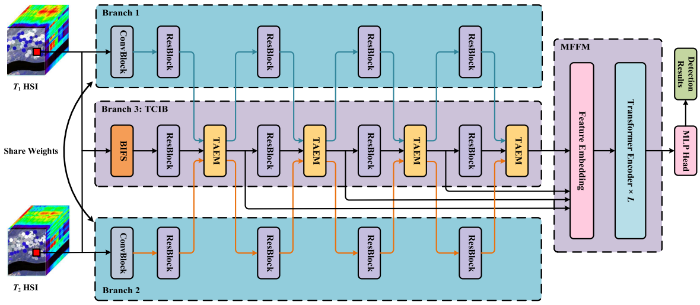

# CDFormer: A Hyperspectral Image Change Detection Method Based on Transformer Encoders --IEEE Geoscience and Remote Sensing Letters

Code for the paper "[Multilevel Features Fused and Change Information Enhanced Neural Network for Hyperspectral Image Change Detection](https://ieeexplore.ieee.org/abstract/document/10366286)".  More specifically, it is detailed as follow. 




## Data

The datasets can be found in https://rslab.ut.ac.ir/data, https://crabwq.github.io/, and https://citius.usc.es/investigacion/datasets/hyperspectral-change-detection-dataset.

## Citation

Please kindly cite the papers if this code is useful and helpful for your research.

 J. Ding, X. Li, S. Xiang and S. Chen, "Multilevel Features Fused and Change Information Enhanced Neural Network for Hyperspectral Image Change Detection," in *IEEE Transactions on Geoscience and Remote Sensing*, vol. 62, pp. 1-13, 2024, Art no. 5502413, doi: 10.1109/TGRS.2023.3344784.  

```tex
@ARTICLE{ding2024multilevel,
  author={Ding, Jigang and Li, Xiaorun and Xiang, Shu and Chen, Shuhan},
  journal={IEEE Transactions on Geoscience and Remote Sensing}, 
  title={Multilevel Features Fused and Change Information Enhanced Neural Network for Hyperspectral Image Change Detection}, 
  year={2024},
  volume={62},
  number={},
  pages={1-13},
  keywords={Feature extraction;Transformers;Semantics;Data mining;Monitoring;Hyperspectral imaging;Task analysis;Attention mechanism;change detection (CD);hyperspectral image (HSI);multilevel features},
  doi={10.1109/TGRS.2023.3344784}}

```

